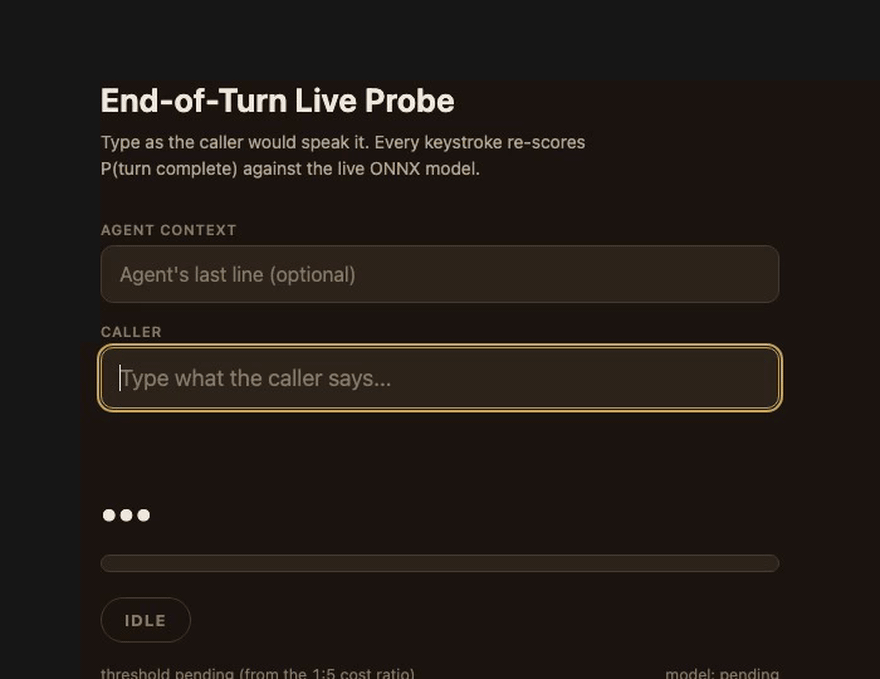

<p align="center">
  
</p>

<p align="center">
  <a href="https://github.com/jameswniu/fine-tuned-turn-detection-transformers/actions/workflows/ci.yml"></a>
  
  
  
  
  
</p>

**One written policy, three referees, and an int8 model that answers in 58 ms.** Built for the HappyRobot AI/ML engineering task: given the agent's last line and the caller's words so far, decide whether the caller is done talking.

Watch it score a call below. Read the write-up in [docs/approach.md](docs/approach.md). Run it with `make serve`. The depth sits next to the code: [POLICY.md](POLICY.md) is the human turn policy everything hangs off, [EVALS.md](EVALS.md) the gates and bands, [iterations.md](iterations.md) the audit trail of every run including the failures, [data/README.md](data/README.md) the dataset card.

## Run it

```bash
python3 -m venv .venv
.venv/bin/pip install -r requirements.txt

make synth        # regenerate the English training set (seeded, byte-identical)
make train        # fine-tune the DistilBERT lane, export ONNX + int8
make eval         # score a model against the frozen gold set
make serve        # FastAPI on :8000, with a live probe page at /
make bench        # async stress test, latency percentiles + throughput
make docker-build && make docker-run && make smoke   # the int8 model in a container
```

<p align="center">
  
</p>

<sub>The `/` page re-scores after every keystroke. A mid-readout holds. "okay, got it." speaks. "actually yeah, one more thing." holds, because the policy says an announced continuation waits. "nah bye" speaks, the miss a live poke found and the regression slice now guards. The from-scratch and Spanish lanes have their own entry points, listed in the map below.</sub>

```bash
curl -s -X POST localhost:8000/predict -H "Content-Type: application/json" \
  -d '{"context": "What is your MC number?", "text": "yeah it is four one five"}'
```

<p align="center"></p>

## How it is judged

<p align="center">
  
</p>

Real-call files stay out of git; only aggregates appear in the docs. The operating threshold is data, not a constant: a written cost ratio (one interruption costs five sluggish responses) applied to the measured curve, picked on the served int8 artifact one row at a time, and shipped next to the weights.

## The judge panel, in software terms

<p align="center">
  
</p>

Part of the data was labeled by stock models rather than people. No weights moved; the written spec rode in the prompt, the exam was blind, and the vote was two of three. Containment does the trust work the way staging contains a deploy: judge output reaches one file, which tunes one number, which twelve human-policy gates clamp. One caveat travels with the exam score. The spec quotes a few boundary examples, so certification was partially open-book. Mechanics, the cost A/B between panel designs, and the raw votes: [docs/judge-cascade-replay.md](docs/judge-cascade-replay.md).

<p align="center"></p>

## Two models, one glance

<p align="center">
  
</p>

| | Fine-tuned DistilBERT, 66M | From-scratch, 7.4M |
|---|---|---|
| Match the written policy, 36 probes | 31 of 35 | 34 of 35 |
| Model latency, mean | 16.6 ms | 2.8 ms |
| Spanish probes (6) | flat 0.75 on all six, three wrong | all six right |

On the 29 English probes the two tie at 28 each and share one miss, an unpunctuated yes-no question both read as a cutoff; the margin is entirely Spanish, which the shipping model never trained for. The fine-tune ships because it leads on unseen real calls, the referee that matters most. [docs/probe-comparison.html](docs/probe-comparison.html) holds every probe, regenerated by `probe_compare.py`.

## Map

```
synth.py            policy-driven English generator (the template banks ARE the policy)
synth_scale.py      same templates, larger slot pools, an order of magnitude more volume
synth_es.py         Spanish banks under the same policy, Spanglish register included
ood_from_elevenlabs.py  real-call eval slice builder (self-labeling turns; local only)
train.py            fine-tune lane (DistilBERT or any HF encoder via --base)
train_scratch.py    from-scratch lane: byte-level BPE tokenizer + small encoder
pretrain_scratch.py masked-language-model pretraining for the from-scratch lane
fetch_pretrain_corpus.py  license-clean bilingual Wikipedia slices for the scratch pretrain
evaluate.py         gold-set and jsonl evaluation: sweeps, classes, calibration, stability
pick_threshold.py   dev-set threshold selection under tier-1 guardrail constraints, scored single-row on the served artifact
serve.py            FastAPI serving over ONNX int8, plus the live probe page
bench.py            async stress harness, stepped concurrency
probe_compare.py    side-by-side probe page for two served models (docs/probe-comparison.html)
judge_cascade_replay.py  replays the dev-set labeling panel two ways over recorded votes, checks the labels match
draw_figures.py     emits every figure above from counted constants; --check fails CI on drift or a font under the 75% floor
labeling-booth.html the calibration booth the gold set was labeled in
assets/             the figures, their GIF, and its mp4
data/               gold set (frozen), generated training sets, judge votes, dataset card
docs/               approach doc, judge replay, probe page, video script
```

Generated reports (eval_report*.json, bench_report*.json, regression_report.json) are build artifacts and stay untracked; every number in the figures and the docs comes from them at freeze time, and `make figures-check` fails if a figure drifts from its constants.
