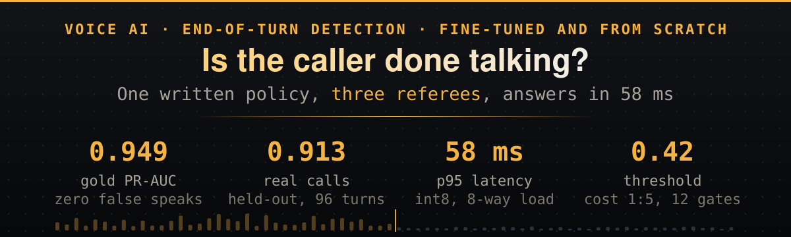
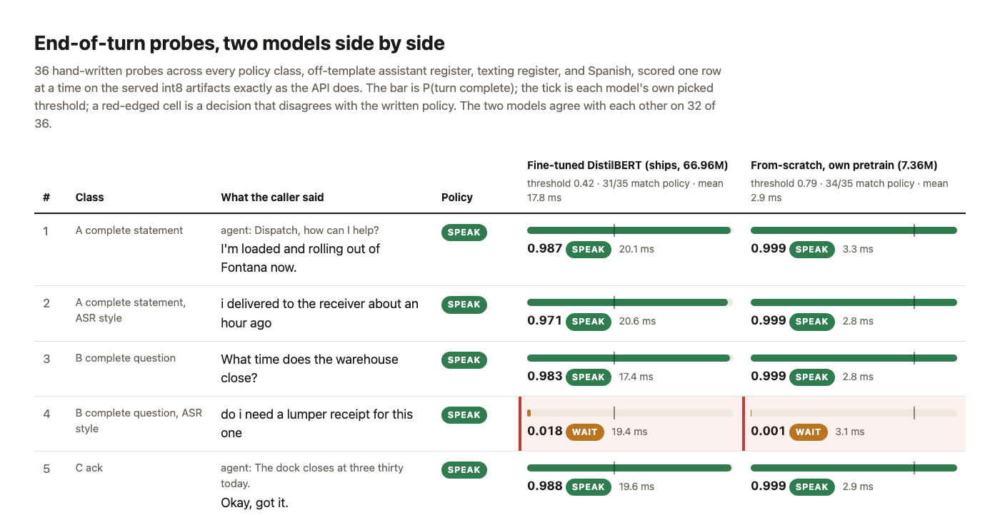
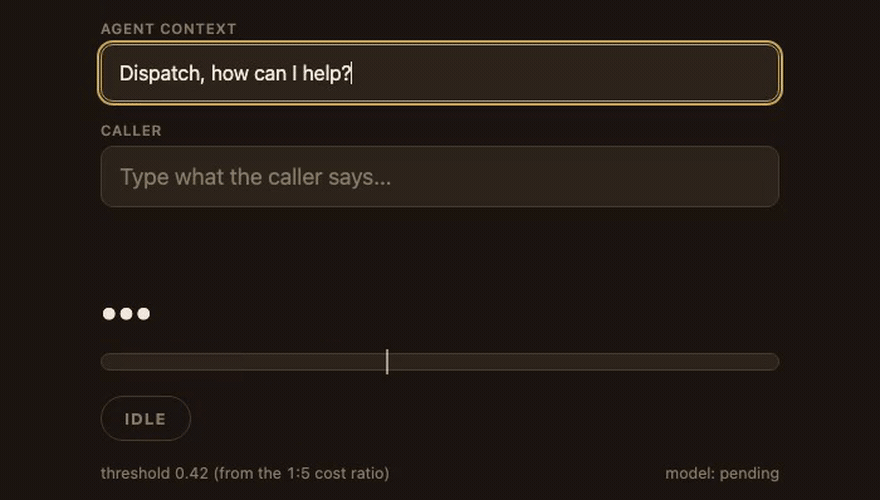
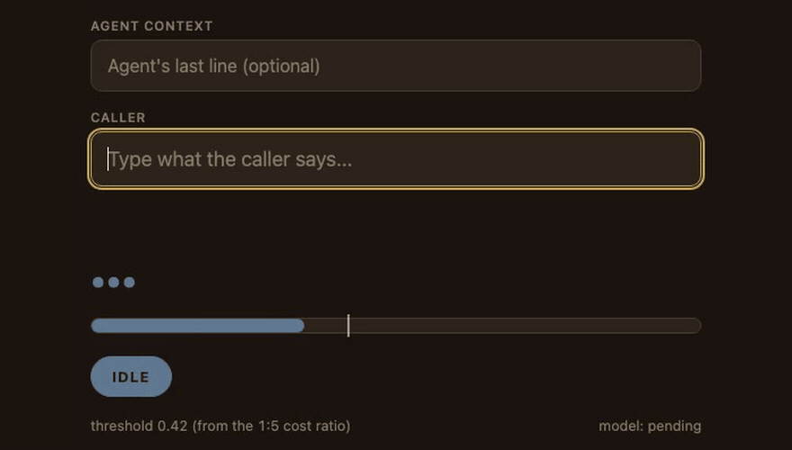
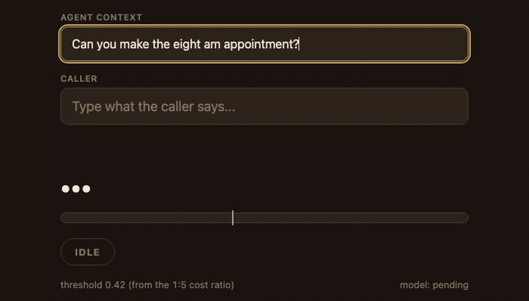
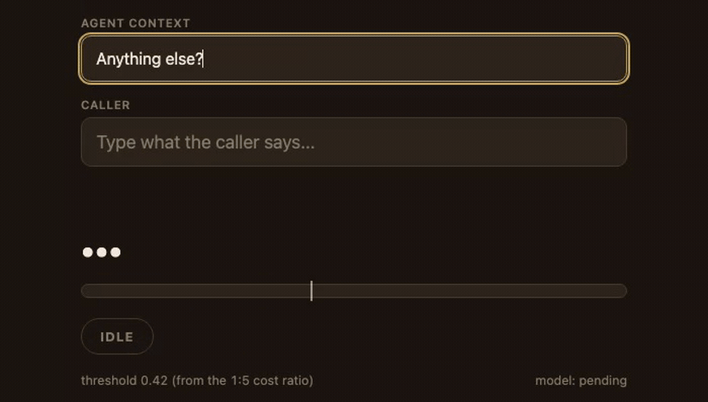
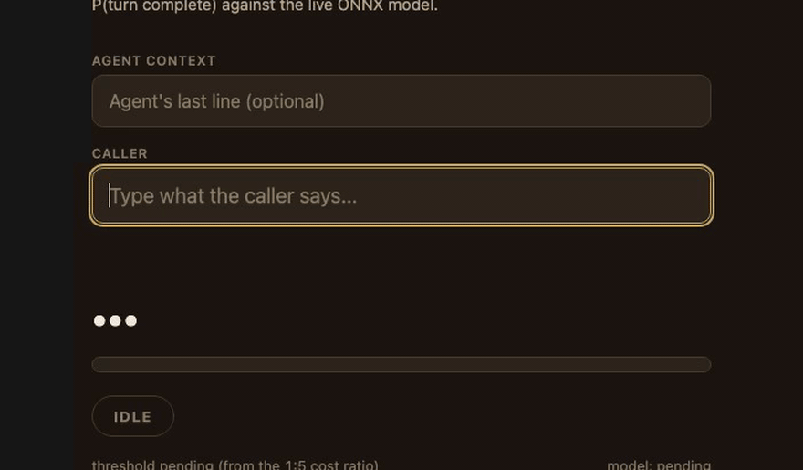
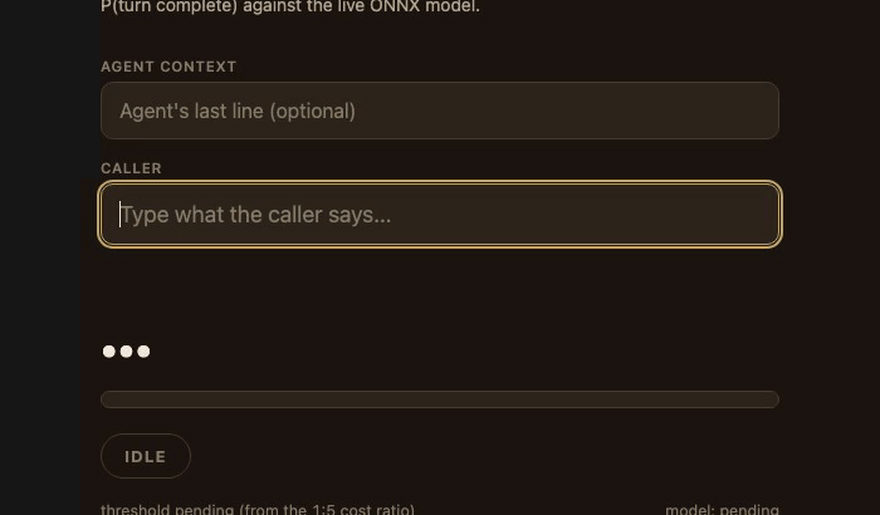
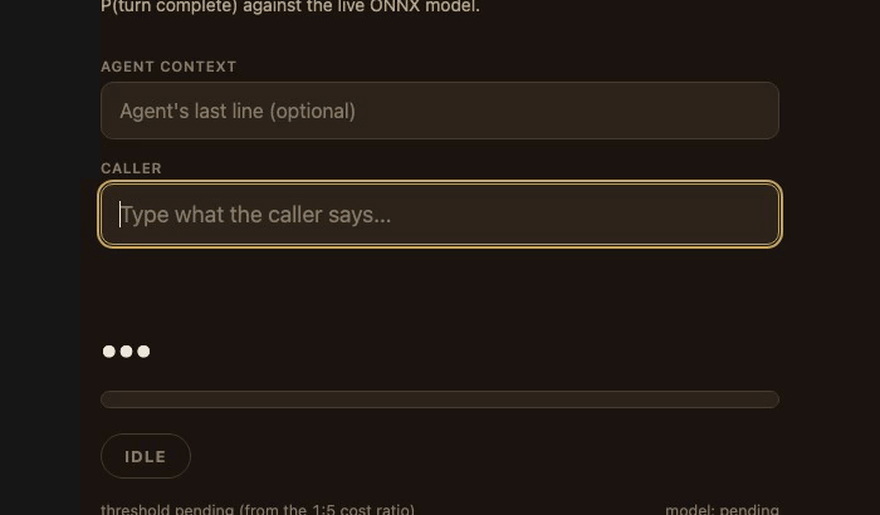
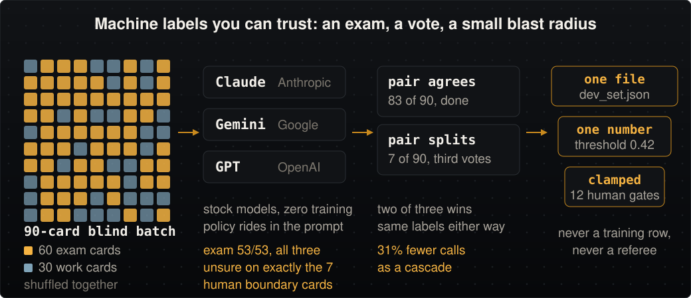

<p align="center">
  
</p>

<p align="center">
  <a href="https://github.com/jameswniu/fine-tuning-turn-detection-model/actions/workflows/ci.yml"></a>
  
</p>

**Given the agent's last line and the caller's words so far, decide whether the caller is done talking.** The fine-tuned DistilBERT ships as int8 at threshold 0.42. On the 53 hard-labeled cards of the 60-card frozen gold set, the other 7 being boundary cards nobody scores, it reads 0.949 PR-AUC, recall 0.654, and speaks over none of the 27 wait cards. On 96 held-out real-call turns it reads 0.913 and speaks over 11 of the 47 wait turns, a rate of 0.234. That gap between the two false-speak numbers is the finding here. End-to-end p95 is 32.8 ms at concurrency 8 on a quiet box, and a 7.36M encoder trained from scratch beat it on the policy probes and lost on unseen real calls, the referee that matters most.

Read [docs/approach.md](docs/approach.md), run it with `make serve`. The depth sits next to the code: [POLICY.md](POLICY.md), [EVALS.md](EVALS.md), [iterations.md](iterations.md), [data/README.md](data/README.md).

## The five hard problems in end-of-turn detection

Four are answered here; the fifth is honest about its ceiling.

| | The problem | Where this stack stands |
|---|---|---|
| 1 | **A complete sentence is not a complete turn.** "Anything else?" answered with "actually yeah, one more thing." is finished grammar, wide-open conversation. | Answered. Announced continuation is a policy class and a tier-1 constraint. That exact card scores 0.035 on the live page and holds. |
| 2 | **The two mistakes cost differently.** Talking over a caller and leaving the line hanging are different failures, so accuracy is the wrong objective. | Answered. A 1:5 cost ratio picks the threshold, 0.42, where the model speaks over none of the 27 gold wait cards and over 11 of the 47 wait turns on held-out real calls. |
| 3 | **There is no ground truth, only a policy.** A label set with no written rule behind it is one person's ear. | Answered. [POLICY.md](POLICY.md) came first; sixty cards blind-labeled against it, and three vendor judges hit 53 of 53. |
| 4 | **The model you measure is not the model you ship.** Quantization moves scores near the threshold. | Answered, after two red iterations. One card read 0.26 on the checkpoint and 0.412 through the serving path. Selection now scores one row at a time, the way serving does. |
| 5 | **Text has no prosody.** Falling pitch and a trailing vowel never reach a transcript. | Not answerable here. The ceiling is the input, not the model; the fix is an audio path, three options in the roadmap below. |

## Two models, measured

Every probe is scored on the served int8 file, one row at a time, the way the API scores it. The page behind the picture holds all 36, side by side. Thirty-five are graded. The 36th is a boundary card the policy calls unsure, so it is shown and not scored.

<p align="center"><a href="https://jameswniu.github.io/fine-tuning-turn-detection-model/"></a></p>


<p align="center">
  
</p>

| | Fine-tuned DistilBERT, 66.96M | From-scratch, 7.36M |
|---|---|---|
| Match the written policy, 35 of the 36 probes graded | 31 of 35 | 34 of 35 |
| Model latency, mean of one run | 17.8 ms | 2.9 ms |
| Spanish probes (6) | 0.814, 0.777, 0.731, 0.734, 0.798, 0.768, mean 0.770, three wrong | All six right |

The latency row is a single-run mean on one laptop. It moves by about a millisecond every time the page is regenerated, and the page reprints whatever the last run measured. On English they tie at 28 each and share one miss, an unpunctuated yes-no question. The fine-tune ships because it leads on unseen real calls.

The `/` page re-scores as you type, word by word, against the served model. Eight cases from the gold set; every one is typable yourself once `make serve` is up.

**A complete statement speaks.**

<p align="center"></p>

**A mid-readout holds.** An absolute wait, however long the pause runs.

<p align="center"></p>

**A complete question speaks.**

<p align="center"></p>

**A complete answer speaks.**

<p align="center"></p>

**An announced continuation holds, even though the sentence is complete.**

<p align="center"></p>

**A self-interrupt holds.**

<p align="center"></p>

**An explicit hold holds silently.**

<p align="center"></p>

**A casual closer speaks.** "nah bye" is the miss a live poke found in v5; the regression slice now guards it.

<p align="center"></p>

Where it is still weak: the judgment calls. A reported-speech hedge like "the broker said it was covered, supposedly..." should make the agent speak, and the model gets 1 of the 5 scored hedge cards right, a rate of 0.20. Class I holds 8 gold cards and 3 of them are labeled unsure, so 5 carry a decision. The explicit-hold class, "hold on, the receiver is waving at me...", sits at half. The bar for every judgment class is 0.60, and [EVALS.md](EVALS.md) tracks both until they clear it.

## Run it

```bash
python3 -m venv .venv
.venv/bin/pip install -r requirements.txt

make synth        # regenerate the English training set (seeded, byte-identical)
make tier1        # derive the twelve guardrail rows from the committed data
make train        # fine-tune the DistilBERT lane, export ONNX + int8
make threshold    # re-pick the operating point on the served int8 file, one row per call
make eval         # score a model against the frozen gold set
make serve        # FastAPI on :8000, with a live probe page at /
make bench        # async stress test, latency percentiles + throughput
make docker-build && make docker-run && make smoke   # the int8 model in a container
make corpus       # one-time, builds the scratch lane's data (adds the datasets package)
make pretrain     # ~15 min, our own masked-language-model base
make scratch      # fine-tune that base into the 7.36M from-scratch model
```

What a clean clone gives you:

- The data rebuilds byte for byte, and the probe cases above come out wait, speak, and wait as described.
- The digits will differ. One clean retrain reads 0.965 gold on its fp32 export and 0.966 on its int8 export, against the 0.949 quoted, and the threshold picker lands on 0.71 for the fp32 file and 0.63 for the int8 one, where the frozen artifact sits at 0.42. Those two picks are the same weights read through two execution paths, which is this repo's own headline finding, not run-to-run variance.
- The real-call files never leave the author's machine, so `make train` rebuilds the pre-augmentation fine-tune, 0.65 on real calls where the shipped artifact reads 0.91.
- Every figure here describes the v9 freeze, whatever your box just trained.

```bash
curl -s -X POST localhost:8000/predict -H "Content-Type: application/json" \
  -d '{"context": "What is your MC number?", "text": "yeah it is four one five"}'
```

<p align="center"></p>

## How it is judged

<p align="center">
  
</p>

- Real-call files stay out of git, and so is every report file, so nothing on this page about real calls regenerates from a clone. The gold, regression, pinned-card and judge numbers all do.
- The threshold is a dial the measured curve turns, a written cost ratio picked on the served artifact and shipped next to the weights.

## The judge panel, in software terms

<p align="center">
  
</p>

- Stock models labeled the dev set under containment, where judge output reaches one file, which tunes one number, which twelve human gates clamp.
- The exam was blind, with one caveat. The spec quotes a few boundary examples, so certification was partially open-book.
- The mechanics and raw votes live in [docs/judge-cascade-replay.md](docs/judge-cascade-replay.md).

<p align="center"></p>

## How the operating point is chosen

- Sweep every threshold on the judged dev cards and keep the lowest cost, counted as five false speaks to one false wait.
- Throw out any threshold that breaks one of twelve pinned cards; if none survive, fail loud.
- Score the artifact that ships, the way it ships: int8, one row per call. The winner lands in `threshold.json` and `serve.py` reads it at startup.

Nine runs, the threshold each picked, and what it taught. ECE is calibration error, lower is better.

| Run | Threshold | Gold PR-AUC | Gold recall | False-speak | ECE | What it taught |
|---|---|---|---|---|---|---|
| v1 | 0.833 | 0.961 | 0.577 | 0.00 | N/A | The textbook 5/6 bar assumes calibration; this model runs under-confident |
| v2 | 0.61 | 0.964 | 0.808 | 0.00 | 0.114 | Picking on the measured curve moved recall |
| v3 | 0.87 | 0.970 | 0.654 | 0.00 | 0.067 | Synthetic validation pushed the dial high; it is easier than real speech |
| v4 | 0.86 | 0.969 | 0.654 | 0.00 | 0.070 | Rates instead of counts did not fix it; the synthetic set was the problem |
| v5 | 0.81 | 0.958 | 0.731 | 0.00 | 0.092 | A human typed "nah bye" and got wait; casual speech joined, the regression file began |
| v6 | 0.18 | 0.955 | 0.654 | 0.037 | 0.169 | Judged dev cards replaced synthetic validation; the dial collapsed, "one more thing" got interrupted |
| v7 | 0.27 | 0.949 | 0.654 | 0.00 | 0.160 | Twelve cards became hard constraints; green on fp32, red on the int8 that serves |
| v8 | 0.40 | 0.949 | 0.654 | 0.00 | 0.160 | Re-picked on int8, 11 of 12; the picker batched where serving scores one at a time |
| v9 | 0.42 | 0.949 | 0.654 | 0.00 | 0.160 | Scored one card at a time, 12 of 12; real calls 0.913, recall 0.959 |

Read v1 through v8 as a build log, not as measurements you can check. Each run wrote its report to the same filename and the next run overwrote it, so only the v9 row survives as a file, and only the v9 row regenerates from the committed artifact. The last three rows share one set of weights; only the measuring instrument changed. The eval gets debugged as hard as the model.

## The policy, as rows

Sixty blind labels became eleven classes with a rule each, and `synth.py` turns the rules into rows.

| Class | Shape | Example, from the gold set | Decision |
|---|---|---|---|
| A | Complete statement | "Hey, I'm calling to confirm the pickup for load four seven two tomorrow morning." | Speak |
| B | Complete question | "What's the detention policy if I'm stuck at the dock past two hours?" | Speak |
| C | Bare acknowledgement | "Okay, got it." | Speak; a complete turn but never a call-ender |
| D | Mid-clause cutoff | "Can you tell the receiver that my ETA is now..." | Wait |
| E | Disfluent trail | "Yeah so, um, the thing is, uh..." | Wait |
| F | Mid-data readout | "Yeah, it's seven one five..." after "Can I get your MC number?" | Wait, absolute, however long the pause runs |
| G | Connector-final | "I can pick up Thursday morning, but..." | Wait |
| H | Complete, then maybe more | "Yeah, I can make it." speaks; "Actually yeah, one more thing." after "Anything else?" holds | Speak, unless continuation is announced |
| I | Trailing hedge | "That's all I need, I guess..." | Speak by default; a decorative softener on an owned claim mid-narrative holds |
| J | Self-interrupt restart | "Can you- actually, you know what..." holds; "I need the- no, scratch that..." speaks | Wait; a full retraction may earn a brief acknowledgement |
| K | Explicit hold | "Hang on, let me grab the load number..." holds; "Hold on, the receiver is waving at me..." speaks | Self-retrieval holds silently; a narrated outside interruption gets a courtesy acknowledgement |

Class I is the ruling I would defend on a whiteboard. "The broker said it was covered, supposedly..." speaks; "The detention was approved, or something..." waits. Ownership decides: an attributed claim is a question in disguise, an owned claim with a softener is just a statement, and attribution markers are surface features a model can learn.

Four augmentations bake in deployment realism:

- Complete utterances get cut off mid-sentence and labeled wait, the exact shape an ASR partial arrives in.
- Everything ships lowercased, punctuation stripped, so nothing can cheat off a period.
- Contexted rows are also emitted bare, so the model works with and without the agent's last line.
- From v6, real-call rows join at four-fold weight, grouped by call so none leak into the referee.

The counts land at 1,586 training rows, 60 gold cards, 30 judged dev cards, 6 regressions, and 400 real turns from 59 calls, split by call into 304 turns over 40 calls for training and 96 turns over 19 calls for the referee.

## Serving, measured

`POST /predict` takes `{context, text}` and returns `{p_complete, decision, threshold, model_latency_ms}`. ONNX Runtime, dynamic int8, CPU; the Docker image serves only the int8 artifact. Both numbers below are end-to-end wall time from `bench.py`, the client's own clock, not model time. Two runs are quoted because they disagree, and the disagreement is a finding about the box, not the model.

| Box state | C1 req/s, wall p95 | C8 req/s, wall p95 | Model p50 at c8 | Model p95 at c8 |
|---|---|---|---|---|
| Quiet machine | 55, 21.2 ms | 316, 32.8 ms | 21.7 ms | 31.0 ms |
| Mid training load | 28, 42.5 ms | 170, 57.9 ms | 39.5 ms | 48.2 ms |

The hero quotes the quiet-box wall p95, 32.8 ms, because three files in this repo say a bench only counts on an idle machine. The 57.9 ms reading was taken while a training run held the same box. It also clears the brief's 100 ms budget, and nothing about the model changed between the two, so read it as the conservative figure rather than the headline.

## Map

```
synth.py            policy-driven English generator (the template banks ARE the policy)
synth_scale.py      same templates, larger slot pools, an order of magnitude more volume
synth_es.py         Spanish banks under the same policy, Spanglish register included
ood_from_elevenlabs.py  real-call eval slice builder (self-labeling turns; local only)
train.py            fine-tune lane (DistilBERT or any HF encoder via --base)
train_scratch.py    from-scratch lane: byte-level BPE tokenizer + small encoder
pretrain_scratch.py masked-language-model pretraining for the from-scratch lane
fetch_pretrain_corpus.py  license-clean bilingual Wikipedia slices for the scratch pretrain
evaluate.py         gold-set and jsonl evaluation: sweeps, classes, calibration, stability
pick_threshold.py   dev-set threshold selection under tier-1 guardrail constraints, scored single-row on the served artifact
serve.py            FastAPI serving over ONNX int8, plus the live probe page
bench.py            async stress harness, stepped concurrency
probe_compare.py    side-by-side probe page for two served models (docs/probe-comparison.html)
judge_cascade_replay.py  replays the dev-set labeling panel two ways over recorded votes, checks the labels match
draw_figures.py     emits every figure above from counted constants; --check fails CI on drift or a font under the 75% floor
labeling-booth.html the calibration booth the gold set was labeled in
assets/             the figures and the eight probe clips
data/               gold set (frozen), generated training sets, judge votes, dataset card
docs/               approach doc, judge replay, probe page, video script
```

## Q&A

Short answers, expandable. Every number has a source in the docs linked above.

<details>
<summary><b>Where do you actually verify this?</b></summary>

At five places, and the rule at every one is to check the artifact that ships.

- CI checks the data first. The gold set must be exactly 60 frozen cards, and no gold text may appear in `data/train.jsonl`.
- CI also runs `python draw_figures.py --check`, which fails the build when a figure drifts from its constants or a label falls under the 75% type floor. Those two checks plus a parse of every module are the whole of CI. It runs no eval, no threshold pick and no pinned-card check, so a green badge here is a data and figure claim, not a score claim.
- The threshold is picked against the served int8 file, one row per call, the shape `serve.py` actually sends. The fp32 checkpoint held a card at 0.26 and the real one-row path returned 0.412, which spoke over the caller.
- Three referees score a model that trained on none of them. `make eval` runs the gold set, and the same script points `--data` at `data/regressions.jsonl` and `data/ood_test.jsonl` for the other two.
- Then by hand at `make serve`. Typing at the live page found the casual-register gap, "nah bye" at 0.34, which became a regression card, then training data, then a fix.

</details>

<details>
<summary><b>Why DistilBERT, and why not something else?</b></summary>

Iteration speed won the night. It is the smallest mature encoder whose fine-tune runs in two minutes on this data, in the model class production systems already ship (LiveKit's text detector at 5 ms, smart-turn at 12 ms).

- Two-minute fine-tunes bought nine audited iterations in one night, and the uncased variant matches ASR text.
- Not compared: MiniLM-L6, DeBERTa-v3-small, ELECTRA-small, ModernBERT, SmolLM2-135M. The from-scratch lane is the comparison that ran.

</details>

<details>
<summary><b>Why int8, and what did it cost?</b></summary>

Standard CPU serving economics, and the one real cost it charged is documented and fixed.

- The bill. Quantization moved a near-threshold score from 0.26 to 0.41 and broke a tier-1 gate twice.
- The fix. v9 picks the threshold on the served int8 artifact one row at a time, and the gate went 12 of 12.

</details>

<details>
<summary><b>Why 0.42, and not 0.5 or the 0.83 the cost ratio implies?</b></summary>

The model runs under-confident (ECE 0.16), so the 1:5 ratio is applied to the measured curve rather than the closed-form 0.833.

- The sweep minimizes five false speaks plus one false wait, constrained by all twelve tier-1 probes.
- Selection on synthetic validation drifted the dial to 0.87 twice, and that lesson is why the judged dev set exists.

</details>

<details>
<summary><b>Why create the data instead of finding a dataset?</b></summary>

No public end-of-turn dataset exists. The builders in this space, LiveKit and pipecat, each made their own.

- Policy-driven synthesis buys auditability, byte-reproducibility, and zero personal data.
- Its known cost, a creator's blind spots, is what the three referees exist to catch, and they caught one. The model learned the vendor's barge-in habit from real-call rows. A policy filter was written for it, and on the shipped files it matched nothing, so the habit is still in the training half and the real-call referee is what shows it.

</details>

<details>
<summary><b>What is the honest ceiling of a text-only model?</b></summary>

Prosody. The question-ness of an unpunctuated yes-no question lives in the caller's rising tone, which the ASR discards.

- Both models miss the same probe, "do i need a lumper receipt for this one", scoring it as a cutoff.
- Agent context recovers it today, recall 1.00 with context against 0.47 bare, and audio features are the roadmap answer.

</details>

<details>
<summary><b>Did you benchmark against the vendor's turn-taker?</b></summary>

Not head-to-head yet, on purpose. The shipped model rides the vendor's transcripts and overrules its decisions where they contradict the policy.

- A policy filter exists to relabel rows where the vendor's live behavior contradicts the written policy, and it caught zero rows in the shipped files, so every real-call label here still carries the vendor's cut points. That residual bias is stated in [EVALS.md](EVALS.md).
- The bake-off is the roadmap chapter, online shadow on a real phone number with disagreements published.

</details>

<details>
<summary><b>How does this run at a million calls a month?</b></summary>

Shadow the incumbent, mine the disagreements, and spend human review only where the two models differ.

- Disagreements are the information-dense turns. Sampled ones get human labels, then feed back as training and referee rows.
- The disagreement rate itself is a drift alarm, and the pattern already ran here three times in miniature.

</details>

<details>
<summary><b>What was measured, and what was not?</b></summary>

Every number on this page is measured on the served int8 artifact. Four things are explicitly not, so silence never reads as a claim.

- fp32 against int8 latency on one box, so the quoted latency is the int8 path only.
- Judge retry variance. Each judge voted once per card.
- Base-model alternatives to DistilBERT.
- Both bench runs are reported rather than one discarded. The quiet-box reading is the one the headline quotes.

</details>

<details>
<summary><b>Roadmap, prosody, and the transcriber route</b></summary>

Nothing here was implemented. It is the plan and its costs, so the gap reads as a scope decision, and the measured limits sit in [docs/approach.md](docs/approach.md).

- Word timings are free today. Vendor ASR responses already carry them, and final-word lengthening plus pause duration are among the strongest endpoint cues in the phonetics literature.
- A small parallel audio model, about a dozen milliseconds on CPU, fuses with the text score at the decision layer.
- Tapping the ASR encoder is free compute but coupled, available only if you host your own ASR.

The transcriber could learn this itself, Whisper through an end-of-turn token in the decoder, a streaming RNN-T through its transducer vocabulary. Both need true turn boundaries, which the self-labeling loop already produces. Either way an audio-side detector needs no words, so it can decide before the transcript settles.

</details>
