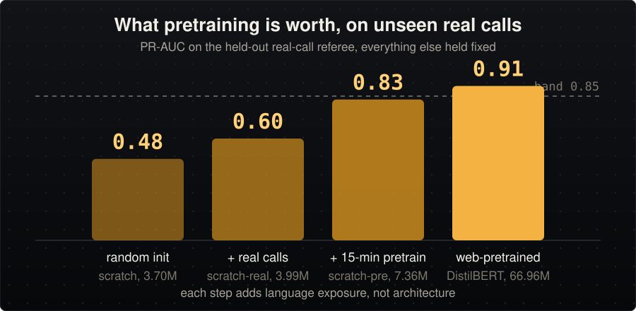
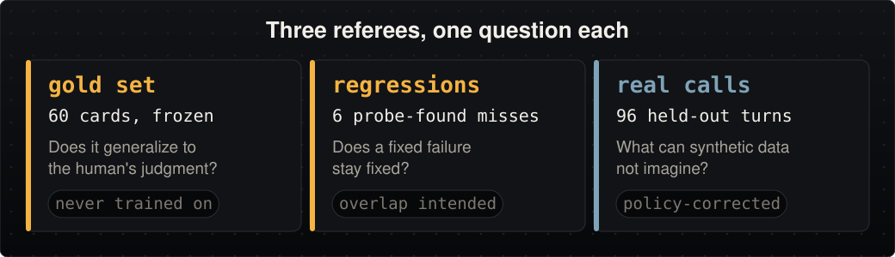

# End-of-Turn Detection, an approach

How I built it and why. The repo carries the depth. POLICY.md holds the turn policy, EVALS.md the gates, data/README.md the data provenance, iterations.md every run.

## The problem, priced

A turn detector can only be wrong two ways.

- Speak too early and it talks over a caller mid-sentence, the error people remember.
- Wait too long and the line just hangs, the toll every turn pays a little of.
- A trivial system is perfect on one axis, so a single accuracy number means nothing.

I wrote the price down before training anything. One interruption costs as much as five sluggish responses. The ratio comes from my own production voice agent, where dead air was the chronic complaint. Bayes turns 1:5 into speak-at-83-percent, but the model measures under-confident, so the operating threshold comes from the measured curve instead, recomputed every run and shipped as data beside the weights. The threshold is a dial.

## Data, policy first

- Eleven pause situations, seven obvious, four judgment classes.
- I blind-labeled sixty cards in a booth built for the job, shuffled so the taxonomy couldn't lean on me, and froze them as a gold set the model never trains on. That is the referee.
- The ruling I would defend on a whiteboard. "The broker said it was covered, supposedly" speaks; "the detention was approved, or something" waits. Ownership decides. An attributed claim is genuine doubt; a first-person softener is politeness. Attribution markers are learnable surface, so the ruling is trainable.

Volume comes from a seeded, pure-code generator, byte-identical on every run, no LLM in the loop.

- Complete utterances get cut off mid-sentence and labeled wait, the exact shape an ASR partial arrives in.
- Everything ships lowercased, punctuation stripped, so nothing can cheat off a period.
- Spanish rides the same policy in the register Spanish-first carriers actually use; the hedge ruling transfers, "me dijeron que".

## Models, three lanes

Fine-tuned DistilBERT (66.96M) is the safe lane. The lane I built from nothing (my own tokenizer, same recipe so the comparison isolates pretraining) failed twice, and each failure bought a finding. It ran at three sizes as the recipe grew: 3.70M at random init, 3.99M once real-call rows joined, and 7.36M with the pretrain step. Every count here is the sum of the ONNX initializer elements of the export.

- A 1532-piece tokenizer turned real text into walls of unknown tokens, and the model flatlined to a constant.
- A leaked template split put fills of the same template on both sides, measuring memorization as generalization.

With the mechanics fixed, the verdict came clean. The model scored 0.99 on its own synthetic data and 0.50 on the human gold cards. Speak-or-wait is a two-way call, so 0.50 is what plain guessing scores. The gap was general language knowledge, which is exactly what pretraining is. The curve on unseen real calls adds one named ingredient per step. 0.48 at random init (3.70M), 0.60 with real data (3.99M), 0.825 with a fifteen-minute pretrain of our own (7.36M), 0.913 where the internet-pretrained fine-tune sits (66.96M).

A written rule picks the default. Scratch ships only at parity on every referee. Its 0.825 on real calls is not the fine-tune's 0.913, so the fine-tune ships: 0.949 gold PR-AUC, no false speaks on the 27 gold wait cards, and 11 false speaks on the 47 wait turns of the held-out real calls, a rate of 0.234. The multilingual lane that ships as the variant reads 0.979 gold against this model's 0.949, and separates the Spanish slice perfectly, so Spanish support is a model swap. It pays for that with gold false-speak 0.407 at its own 0.97 threshold and ECE 0.349.

## Evaluation

- The frozen gold set grades quality and is never trained on.
- A separate dev set picks thresholds, labeled by three vendor judges, each certified against the gold cards before its votes count.
- A regression slice holds every failure found by live probing.

Then the referee that changed the build. I pulled 59 real production calls from my own agent and let a rule label them. Where the caller stopped is a true complete, a mid-turn prefix cut at a random non-sentence-final word is a true wait, and no person reviewed either. Nineteen of the calls, 96 turns, were locked away. The model of that moment read 0.96 with zero false-speak on gold and scored 0.61 across all 400 real turns at its then-threshold of 0.81, a different set and a different dial from the 96-turn held-out referee everything else on this page uses. Every offline referee agreed with each other, and the real world disagreed with all of them. The fix ran inside the build. The other two thirds became training augmentation, graded on the locked third, and the shipping model went from 0.65 to 0.913 with recall 0.959. Raw call content never enters the repo.

| Model | Params | Gold PR-AUC | Gold false-speak at op | Spanish PR-AUC | Real calls PR-AUC | Real calls at op (false-speak / recall) | Tier-1 window | ECE |
|---|---|---|---|---|---|---|---|---|
| Fine-tuned DistilBERT (ships) | 66.96M | 0.949 | 0.000 | not trained for | 0.913 | 0.234 / 0.959 | 56 of 99 at 0.42 | 0.160 |
| Multilingual DistilBERT + real | 135.33M | 0.979 | 0.407 | 1.000 | 0.875 | 0.191 / 0.878 | 4 of 99 at 0.97 | 0.349 |
| From-scratch, own pretrain | 7.36M | 0.973 | 0.037 | 1.000 | 0.825 | 0.277 / 0.755 | 60 of 99 at 0.79 | 0.062 |
| From-scratch, real calls, no pretrain | 3.99M | 0.994 | 0.000 | 0.996 | 0.597 | collapse | not picked | 0.045 |
| From-scratch, random init | 3.70M | 0.502 | 0.889 | 0.992 | 0.477 | collapse | not picked | 0.488 |

## Serving and latency

- FastAPI over ONNX Runtime, dynamic int8, CPU, one worker.
- The threshold reads from the model directory, so a retrain updates the dial without touching serving code.
- A Dockerfile ships only the int8 model; the same process serves a live probe page that re-scores as you type.

The brief asked for under 100 ms. Measured on my laptop, end-to-end wall time from the client rather than model time. The first row is the shipped artifact on a quiet box and is the reading this repo quotes. The two loaded rows were taken minutes apart while a training run held the same machine, which is why the multilingual lane has no quiet reading yet.

| Served artifact | Box state | c1 wall p50 | c8 wall p50 | c8 wall p95 | c8 req/s |
|---|---|---|---|---|---|
| Fine-tuned DistilBERT, 66.96M (ships) | quiet | 17.6 ms | 23.4 ms | 32.8 ms | 316 |
| Fine-tuned DistilBERT, 66.96M | training load | 34.7 ms | 45.5 ms | 57.9 ms | 170 |
| Multilingual DistilBERT, 135.33M | training load | 34.0 ms | 49.7 ms | 97.2 ms | 147 |
| From-scratch, 7.36M | quiet | 7.4 ms | 12.1 ms | 20.7 ms | 588 |

## Monitoring at a million calls a month

Turn detection grades itself in production, seconds later, for free.

- A speak decision followed by the caller talking over the agent was a false speak.
- A wait decision followed by dead air until a timeout was a false wait.
- Those two rates are the online eval, no annotation cost, mapping one to one onto the offline curve.

A small audited weekly sample keeps them honest; slice by language, accent, connection, customer. Ship shadow-first, promote on the measured curve, roll back with a pointer flip. The brief asks directly whether the datasets built here are the limit. Yes, deliberately, until launch. My synthesis encodes policy, production volume supplies distribution, and that handoff is the whole monitoring design.

## The discussion questions

The ceiling of text-only is prosody, and it sits in the input. Pitch decline, final lengthening, and breath never reach the model, so some finished and unfinished utterances read identically. Multimodal is my next step, a small audio encoder fused at the decision layer, and the referees built here transfer to it unchanged, which is the point of building the referee first.

Could the transcriber do the job? ASR is trained prosody-invariant, so the signal dies at the text bottleneck. Three tiers follow.

- Free today: vendor word-level timestamps carry final-word lengthening and pause duration, two of the strongest endpoint cues. Feeding them in adds no model and no latency.
- Whisper: learn an end-of-turn token, read its probability from the same forward pass that produces the transcript.
- Streaming RNN-T: an end-of-utterance token in the transducer vocabulary, or a classifier head off the encoder states.

All need true boundaries, which the self-labeling loop produces. I would keep the detector separate while iterating and consider distilling later, since coupling puts two jobs on one latency budget.

In integration, the detector sits between streaming ASR and the LLM trigger. VAD flags a pause, the score maps to an endpoint delay, high commits, middling waits, low holds and re-scores per partial. Barge-in stays untouched, and the model adds single-digit milliseconds sitting next to the orchestrator. What else a reviewer might raise sits in collapsed blocks at the bottom of the README.

## Assumptions, written down

- The 1:5 cost ratio is a documented operating choice, and a different ratio is a one-line change.
- Inputs arrive ASR-style, lowercased, no terminal punctuation, last agent utterance as context.
- The decision is binary, speak or wait; response policies are out of scope.
- Languages are English and Spanish.
- The latency budget is 100 ms end to end on CPU, no GPU anywhere.
